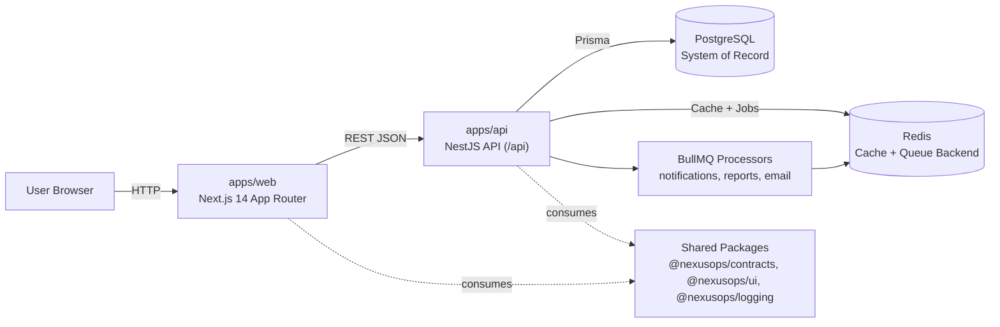
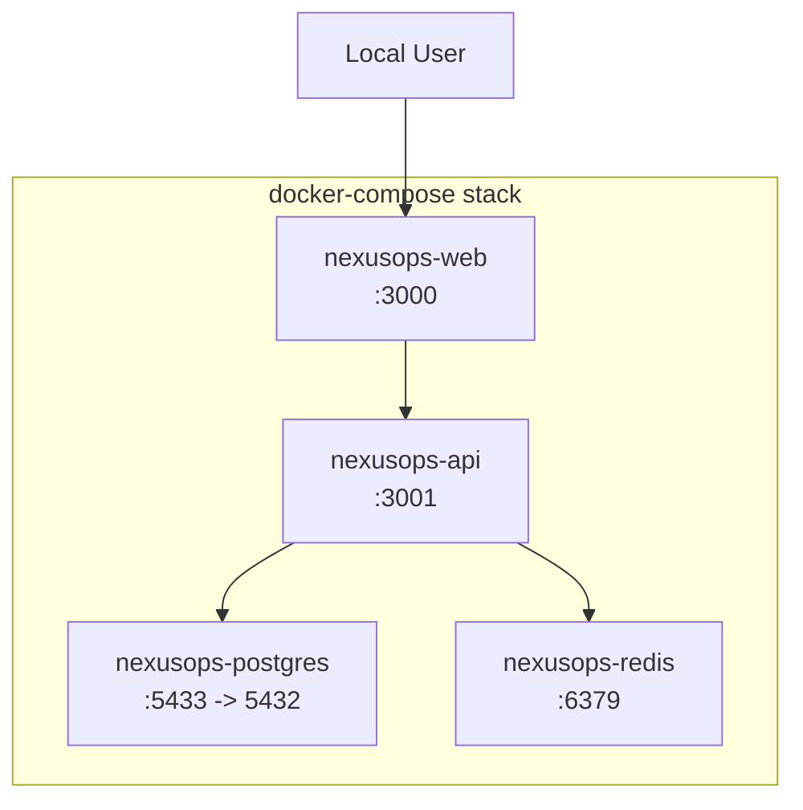
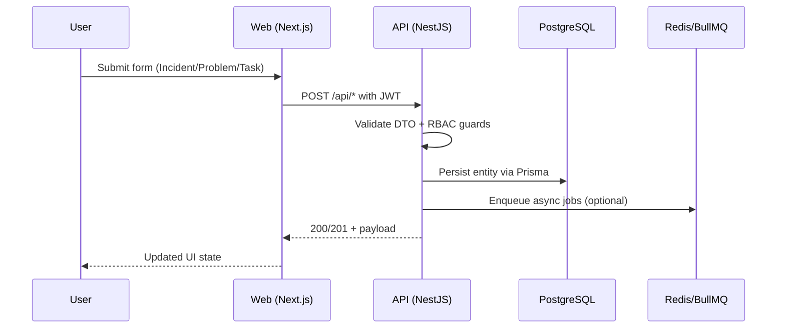
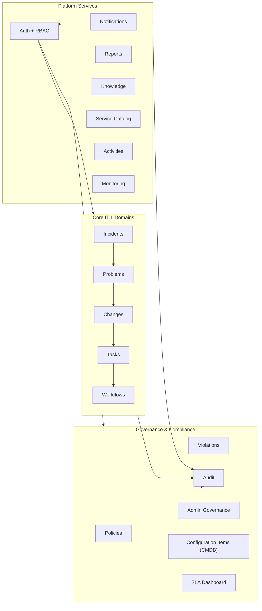

# NexusOps Control Center

Enterprise operations and compliance orchestration platform built around ITIL workflows.

This repository is a `pnpm` monorepo containing:
- `apps/web` (Next.js 14 frontend)
- `apps/api` (NestJS backend)
- `apps/worker` (worker scaffold)
- `packages/contracts`, `packages/logging`, `packages/ui` (shared libraries)

## AI Development Attribution

This project includes a mixed-AI implementation model:
- ~90% of the codebase was written by **GLM5 with Droids + multiple skills**.
- ~10% of issue resolution, fixes, and hardening was completed by **Codex 5.3 High**.

This attribution is documented for transparency of build process and authorship context.

## Product Scope

NexusOps provides unified operations workflows including:
- Incident management
- Problem management
- Change management
- Task management
- Workflow orchestration
- Knowledge base
- Service catalog
- SLA dashboard
- Compliance, policy, and violation tracking
- Audit logs and activity history
- Admin governance and access controls

## What NexusOps Control Center Does

NexusOps Control Center is designed to run day-to-day IT service operations and governance from one workspace. It combines operational ticketing, risk/compliance controls, and audit visibility so teams can move quickly without losing traceability.

Key outcomes the platform targets:
- Faster incident response and clearer ownership
- Better root-cause management through problem workflows
- Safer change execution with approval and governance gates
- Centralized evidence for compliance and audits
- Unified operational context across teams, records, and timelines

## Functions and Features

### Core ITIL Operations

- Incidents:
  - Create, update, filter, assign, transition, and merge duplicate incidents
  - Track lifecycle from `new` to `resolved`/`closed` with workflow-aware transitions
  - Add comments and export incident datasets
- Problems:
  - Create and manage problem records with linked incidents
  - Track investigation stages and convert records to known errors
  - Associate remediation tasks and accountability
- Changes:
  - Create and manage change requests across change types
  - Support approval-oriented flow for normal/emergency change execution
  - Track implementation progress and post-change status updates
- Tasks:
  - Create, assign, start, complete, reopen, cancel, and delete tasks
  - Use task stats and state transitions for operational throughput visibility
- Workflows:
  - Create workflows directly or from templates
  - Advance, cancel, rollback, and analyze workflow exceptions

### Service Delivery and Knowledge

- Service Catalog:
  - Manage service catalog items
  - Submit and process service requests with approval/fulfillment steps
- Knowledge Base:
  - Create, version, publish, archive, and search knowledge articles
  - Track helpfulness feedback and support version reverts
- Notifications:
  - In-app notifications, unread tracking, and read-all actions
  - Notification preferences for user-level delivery controls

### Governance, Risk, and Compliance

- Policies and Exceptions:
  - Define policies and manage policy exception requests/decisions
- Violations:
  - Create, assign, acknowledge, remediate, and classify violations
  - Use violation analytics to prioritize remediation effort
- CMDB (Configuration Items):
  - Manage configuration items and item relationships
  - Link operational activity to managed assets/services
- SLA Management:
  - SLA policies and dashboard views for response/resolution tracking
  - Priority-aware monitoring of service commitments
- Audit and Activities:
  - Immutable-style operational audit logging for actions and transitions
  - Unified activity stream for cross-domain traceability
- Admin Governance:
  - Role and permission management (RBAC)
  - Governance structures for elevated/admin process control

### Platform and Engineering Features

- Authentication and Authorization:
  - JWT-based auth with guard-driven permission enforcement
  - Resource/action-style RBAC controls
- API and Contracts:
  - REST API with DTO validation and OpenAPI/Swagger documentation
  - Shared contract package to align backend/frontend types
- Reliability and Observability:
  - Structured logging with correlation IDs
  - Monitoring endpoints for health and metrics
  - Redis-backed queue processors for asynchronous workloads
- Frontend UX Foundation:
  - Consistent AppShell layout with left-side navigation
  - Command palette for fast record creation and route navigation
  - Reusable tables, record pickers, and modal/sheet interaction patterns

## Typical Operational Flows

- Incident to Problem to Change:
  - Triage incident, investigate pattern, open problem, then execute a governed change.
- Request to Fulfillment:
  - Submit service request, route through approval, fulfill, and close with traceable history.
- Violation to Remediation:
  - Register violation, assign owner, track remediation, and retain audit evidence.
- Knowledge-Centered Operations:
  - Capture resolution knowledge, publish article versions, and reuse proven runbooks.

## Who Uses NexusOps

- Service Desk and Operations teams:
  - Manage incidents, requests, and task execution.
- SRE/Platform and Engineering teams:
  - Coordinate changes, root-cause work, and reliability improvements.
- Security, Risk, and Compliance stakeholders:
  - Track violations, policy exceptions, and audit-ready evidence.
- IT Leadership and Governance boards:
  - Monitor SLAs, operational health, and control effectiveness.

## Architecture Overview



## Mermaid Diagrams

### Container Topology



### Request Lifecycle



### Backend Domain Map



## Monorepo Structure

```text
.
├── apps/
│   ├── api/                 # NestJS API + Prisma schema/migrations
│   ├── web/                 # Next.js app router frontend
│   └── worker/              # Worker container scaffold
├── packages/
│   ├── contracts/           # Shared TypeScript contracts/types
│   ├── logging/             # Shared structured logging utilities
│   └── ui/                  # Shared UI primitives/components
├── docs/                    # Architecture, API, and ITIL planning docs
├── docker-compose.yml       # Local container topology
└── Makefile                 # Common Docker shortcuts
```

## Backend Architecture (`apps/api`)

Core implementation style:
- NestJS modular architecture (`controller` + `service` + `dto` + `module`)
- Prisma-backed persistence
- JWT authentication and RBAC guards
- Redis-backed queue and cache infrastructure
- Centralized structured logging with correlation IDs
- Swagger OpenAPI docs at `/api/docs`

Key module domains:
- `incidents`, `problems`, `changes`, `tasks`, `workflows`
- `policies`, `violations`, `configuration-items` (CMDB), `sla-dashboard`
- `knowledge`, `service-catalog`, `notifications`, `reports`
- `auth`, `users`, `roles`, `teams`, `organizations`, `audit`, `activities`
- `admin-governance`, `monitoring`, `settings`, `export`

## Frontend Architecture (`apps/web`)

Core implementation style:
- Next.js 14 App Router pages under `src/app`
- Shared shell/navigation pattern through `AppShell`
- React Query for asynchronous server state
- Reusable UI primitives and domain components
- Shared API contracts/packages consumed from workspace libraries

Important UX building blocks:
- Left navigation + contextual page layouts
- Command palette for quick actions/navigation
- Form-driven create/edit flows for incidents, tasks, and problems
- Data-heavy operational screens (tables, filters, metrics cards)

## Shared Packages

- `@nexusops/contracts`: common DTOs/types for frontend/backend alignment.
- `@nexusops/logging`: structured logger utilities and middleware support.
- `@nexusops/ui`: shared UI toolkit built on React + Radix primitives.

## Runtime Topology (Docker)

`docker-compose.yml` starts:
- `nexusops-web` on `http://localhost:3000`
- `nexusops-api` on `http://localhost:3001`
- `nexusops-postgres` on `localhost:5433`
- `nexusops-redis` on `localhost:6379`

## Prerequisites

- Node.js `>=20`
- `pnpm` (workspace package manager)
- Docker + Docker Compose (recommended for full local stack)

## Quick Start (Docker)

```bash
cp .env.example .env
make up
make ps
```

Then open:
- Web UI: `http://localhost:3000`
- API base: `http://localhost:3001/api`
- Swagger docs: `http://localhost:3001/api/docs`

Stop stack:

```bash
make down
```

## Quick Start (Without Docker)

1. Install dependencies:

```bash
pnpm install
```

2. Start infrastructure services (Postgres/Redis) with Docker or local equivalents.

3. Run app services:

```bash
pnpm dev
```

4. Run database setup from API package:

```bash
pnpm db:migrate
pnpm db:seed
```

## Environment Configuration

Copy `.env.example` to `.env` and configure:
- `DATABASE_URL` (PostgreSQL connection string)
- `REDIS_URL` (Redis connection)
- `JWT_SECRET`, `JWT_EXPIRES_IN`, `JWT_REFRESH_EXPIRES_IN`
- `PORT`, `NODE_ENV`, `CORS_ORIGIN`

Docker defaults currently map Postgres to `localhost:5433`, API to `3001`, and Web to `3000`.

## Common Commands

- `pnpm dev` - run workspace dev servers in parallel
- `pnpm dev:web` - run frontend only
- `pnpm dev:api` - run API only
- `pnpm build` - build all apps/packages
- `pnpm lint` / `pnpm lint:fix` - linting
- `pnpm format` / `pnpm format:check` - formatting
- `pnpm test` - run workspace tests
- `make up` / `make down` / `make logs` / `make ps` - Docker lifecycle

## Database and Migrations

API package provides Prisma workflows:
- `pnpm --filter @nexusops/api db:generate`
- `pnpm --filter @nexusops/api db:migrate`
- `pnpm --filter @nexusops/api db:migrate:prod`
- `pnpm --filter @nexusops/api db:seed`
- `pnpm --filter @nexusops/api db:studio`

Schema is located at `apps/api/prisma/schema.prisma`.

## Documentation Index

- Architecture deep-dive: `docs/architecture.md`
- API endpoint reference: `docs/api-reference.md`
- ITIL alignment plans: `docs/itil-implementation-plan.md`
- Sidebar/domain planning: `docs/itil-sidebar-sections/README.md`

## Quality and Testing

- API tests use Jest (`*.spec.ts`, integration coverage for key audit flows).
- Frontend currently relies on manual verification for many UX flows.
- Linting and formatting are enforced across the workspace.

## Notes

- Build artifacts in `dist/` and `.next/` are generated and should not be edited manually.
- `apps/worker` currently acts as a scaffold for future background-worker expansion.
