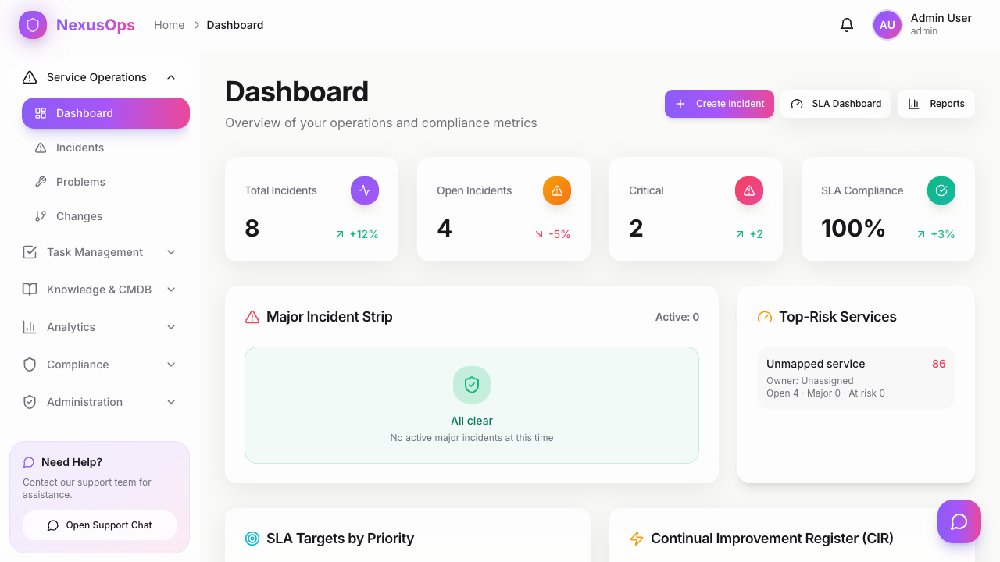
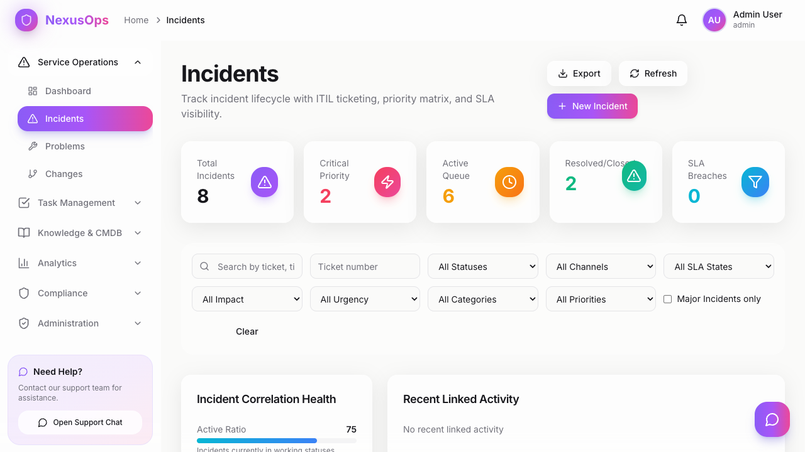
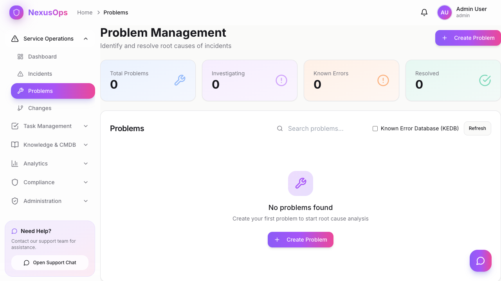
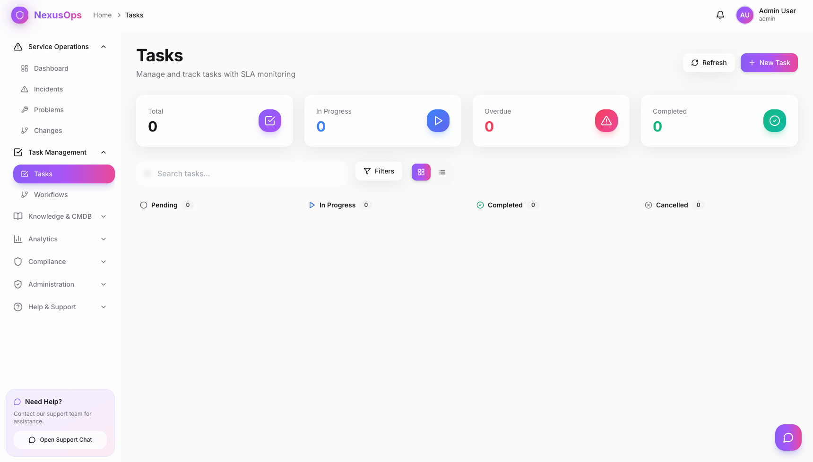
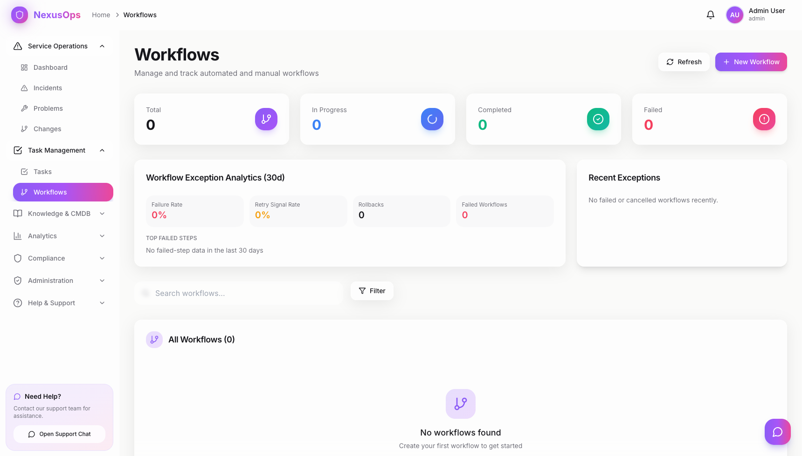
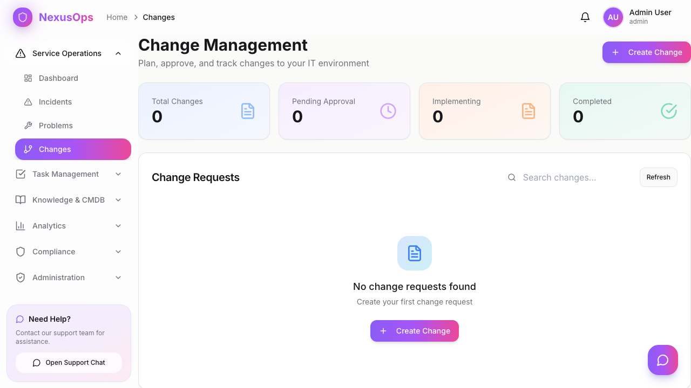

# NexusOps UI Sections Overview

This page provides a quick visual walkthrough of major NexusOps Control Center sections.

## Dashboard

The main operations overview with SLA, incident, and cross-domain health metrics.

Key features:
- KPI cards and trend summaries
- Major incident strip and risk highlights
- Quick actions for incidents, SLA, and reports

## Incidents

Central workspace for incident intake, triage, filtering, and lifecycle tracking.

Key features:
- Incident list with status and priority controls
- Create and update incident workflows
- Duplicate handling and operational context

## Problems

Problem management area focused on root-cause investigation and linked incident patterns.

Key features:
- Problem list and state tracking
- Linked incident context
- Structured problem records for known-error workflows

## Changes

Change management section for request planning, approval, and execution visibility.

Key features:
- Change request tracking by lifecycle stage
- Governance-ready change records
- Progress and implementation flow controls

## Tasks

Task execution board for assignment, ownership, and day-to-day operational work.

Key features:
- Task list with status progression
- Assignment and team coordination
- Operational task throughput visibility

## Workflows

Workflow orchestration area for templated and custom operational workflows.

Key features:
- Workflow list and status management
- Template-based workflow creation
- Lifecycle actions (advance, cancel, rollback)

## Reports

Analytics and reporting section for performance and compliance-oriented output.

Key features:
- Report job views and run controls
- Operational analytics access point
- Data export-oriented reporting workflow

## Knowledge Base

Knowledge management area for article discovery and operational knowledge reuse.

Key features:
- Searchable knowledge content
- Article lifecycle support (draft/publish/archive)
- Runbook and resolution knowledge access
